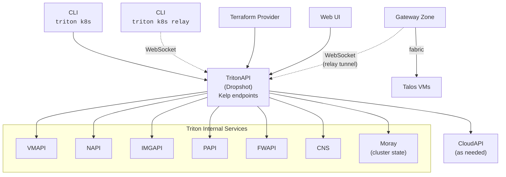

<!--
    This Source Code Form is subject to the terms of the Mozilla Public
    License, v. 2.0. If a copy of the MPL was not distributed with this
    file, You can obtain one at http://mozilla.org/MPL/2.0/.
-->

<!--
    Copyright 2026 Edgecast Cloud LLC.
-->

# Kelp: Kubernetes as a Service for Triton DataCenter

## 1. Introduction

Kelp aims to provide a managed Kubernetes service for Triton DataCenter enabling
customers to provision, operate, and scale fully isolated Kubernetes clusters
on Triton infrastructure. Customers interact with the service through four
interfaces: an HTTP API (hosted in the new TritonAPI Dropshot service), the
`triton k8s` CLI, a Terraform provider, and a web UI.

Each Kubernetes cluster is composed of dedicated Triton VMs running Talos
Linux. Clusters are fully isolated — each has its own control plane, worker
nodes, and at least one network fabric. A single Triton account may own
multiple clusters, enabling organizations to provision separate clusters
for different teams, environments, or workloads.

### How to Read This Document

Each major section is organized into three tiers:

- **Demonstrated** — What we have built and tested. These are
  working prototypes and experiments with validated results.
- **Proposed** — What we would likely build next based on what we have
  demonstrated. These are concrete plans with a clear path to delivery.
- **Future** — Longer-term goals, open questions, and areas that are
  still being explored. These may change significantly as the project
  evolves.

## 2. Architecture

### Demonstrated

A `triton k8s` CLI prototype that exists in monitor-reef has demonstrated the full
cluster lifecycle — create, bootstrap, health, kubeconfig, worker/control
node management, upgrades, and load balancer installation — running
against CloudAPI. This prototype validates the technical approach and helps
define a possible MVP feature set.

The CLI calls CloudAPI, which in turn calls the following internal
services:

| Service | Operations Used |
|---------|----------------|
| **VMAPI** | Create, get, list, delete VMs. Metadata CRUD (command channel). NIC management. Firewall enable. |
| **NAPI** | List/get networks. Create/delete fabric networks and VLANs. List network IPs. |
| **IMGAPI** | Resolve Talos images by name/version. |
| **PAPI** | Resolve VM packages by name. |
| **FWAPI** | Create firewall rules for control plane access. |
| **CNS** | DNS suffix resolution for LB and service discovery. |

### Proposed

TritonAPI, a new Dropshot-based HTTP service, will be the single entry
point for all Kelp operations. It follows the monitor-reef pattern: API
traits define the interface, Progenitor generates typed clients, and
implementations are separate crates.

TritonAPI will communicate directly with Triton's internal services
(VMAPI, NAPI, IMGAPI, PAPI, FWAPI, CNS) rather than routing through
CloudAPI. It can still leverage CloudAPI functionality for anything not
yet available in TritonAPI via TritonAPI's ability to proxy to CloudAPI
using the same endpoint.

Cluster metadata and state will be stored in Moray. A Rust Moray client
for Dropshot is in active development.



### Future

- **WFAPI (workflow orchestration)**: WFAPI is Triton's general-purpose
  workflow engine, used in production for all VM provisioning. It provides
  resumable job execution, per-task retry with backoff, error/rollback
  chains, job locking, and state persistence in Moray. It is not coupled to any specific Triton operation — Kelp could define custom workflows.

  However, there is significant friction:
  - **No intra-job parallelism** — tasks in a chain are strictly
    sequential. Provisioning N workers requires N separate jobs.
  - **Idempotency is the caller's responsibility** — WFAPI retries tasks
    but does not prevent duplicate side effects.
  - **JavaScript only** — workflow task bodies are JS functions in a
    sandboxed VM. TritonAPI is Rust/Dropshot, so WFAPI workflows would
    be a JS sidecar rather than native Rust code.
  - **No conditional branching** at the workflow level — must be
    implemented inside task body logic.

  The language mismatch is the biggest concern. Two integration paths:
  (a) TritonAPI submits workflows to WFAPI via its REST API and polls
  for results, or (b) Kelp implements its own workflow state machine in
  Rust with state in Moray, skipping WFAPI entirely. Path (b) loses
  WFAPI's battle-tested runner infrastructure but gains native Rust
  integration and intra-step parallelism.

## 3. Control Plane to Node Communication

### Demonstrated

The `triton k8s` CLI prototype communicates with Talos nodes by
connecting directly to the Talos gRPC API over the network. The CLI
creates firewall rules during bootstrap that allow access to the Talos
API port (50000) on control plane nodes, then authenticates using the
cluster's Talos PKI credentials. This approach has been proven to work
for all lifecycle operations: bootstrap, apply-config, upgrade, health,
kubeconfig, reboot, shutdown, reset, version, and etcd-members.

A separate experiment, the triton-talos-bridge, has demonstrated an
out-of-band alternative. This is a Talos system extension that uses
SmartOS VM metadata as a command channel — TritonAPI writes commands to
VM metadata keys via VMAPI, the bridge daemon polls for them and executes
them against the local Talos gRPC API, and results are written back. A
working prototype exists in the `triton-talos-bridge` repository. This
approach requires building a custom Talos image or system extension
that must be baked into every cluster VM image.

### Proposed

#### Relay Tunnel via Gateway Zone

A small gateway zone provisioned on each cluster's fabric network
establishes an outbound WebSocket connection to TritonAPI. This reverses
the connection direction — the gateway zone dials TritonAPI, not the
other way around — eliminating the need for inbound firewall rules or
direct network access from TritonAPI to cluster nodes.

Each cluster's gateway zone runs a lightweight agent that:

1. Opens a WebSocket to TritonAPI and authenticates with a JWT.
2. TritonAPI registers the tunnel: cluster X is reachable via this
   connection.
3. The connection stays open with heartbeats; the agent reconnects on
   failure.
4. Multiple logical connections are multiplexed over the single
   WebSocket using yamux.

When TritonAPI needs to reach a cluster node — for lifecycle operations,
health checks, or proxied user access — it opens a yamux stream
targeting an address on the fabric network (e.g. `10.0.0.5:50000` for
Talos, `10.0.0.5:6443` for the Kubernetes API). The gateway zone dials
the target and bridges bytes.

```
TritonAPI                  Gateway Zone           Cluster Nodes
    │                            │                       │
    │◄── WebSocket (outbound) ──┤                       │
    │    Auth: JWT               │                       │
    │                            │                       │
    │── yamux CONNECT ─────────►│── fabric dial ───────►│
    │   10.0.0.5:50000 (Talos)  │                       │ :50000
    │                            │                       │
    │── yamux CONNECT ─────────►│── fabric dial ───────►│
    │   10.0.0.5:6443 (K8s)    │                       │ :6443
```

The pattern is similar to Cloudflare Tunnel (cloudflared) — a small
agent on the private network initiates the connection outward, and the
public-facing service multiplexes traffic back through it.

#### Customer Access via Relay

Customer access to `kubectl` and `talosctl` uses the same tunnel
infrastructure. The `triton k8s relay` command connects to TritonAPI
via WebSocket; TritonAPI bridges the user's streams to the cluster's
gateway zone tunnel:

```
$ triton k8s relay my-cluster
Listening on localhost:6443 (k8s) and localhost:50000 (talos)
KUBECONFIG written to /tmp/triton-k8s-my-cluster.kubeconfig
```

Standard `kubectl` and `talosctl` run against the local endpoints.
TritonAPI authentication is handled by the relay command; Kubernetes
and Talos authentication flows end-to-end through the tunnel.

The relay is the managed, recommended access path. Customers who
require direct network access — for example during TritonAPI
maintenance — can configure Triton firewall rules to allow access
from specific source IPs. This is self-service using existing Triton
primitives.

#### Implementation Notes

Both sides of the relay — gateway zone tunnels and user relay
sessions — are WebSocket connections. Dropshot supports WebSocket
natively via `#[channel]`, so the relay endpoints live in TritonAPI
without framework workarounds or additional services.

The gateway zone agent is a small Rust binary using tokio, yamux, and
WebSocket libraries. It reads configuration from VM metadata
(`mdata-get`), maintains the WebSocket connection, and for each
incoming yamux stream connects to the requested target on the fabric
network. The binary has no runtime overhead, making it suitable for
memory-constrained zones.

The agent authenticates to TritonAPI using a JWT delivered via VM
metadata. TritonAPI writes fresh tokens to the zone's metadata
periodically via VMAPI before the previous token expires. The
metadata channel is out-of-band (delivered through the hypervisor,
not the network), so it is not observable or interceptable by
customer workloads on the fabric.

#### Gateway Zone Hosting

The relay agent requires a zone on the fabric network. Two options
are under consideration:

**Dedicated gateway zone.** A purpose-built zone provisioned per
fabric during cluster bootstrap. Simple to reason about but adds
an additional zone to manage per fabric.

**NAT zone reuse.** Triton already provisions an admin-owned NAT
zone on each fabric network. The relay agent could be added to the
NAT zone image and activated via metadata — TritonAPI writes
`triton:relay:enabled`, `triton:relay:endpoint`, and credential
keys; the agent picks them up and starts the tunnel. Existing
fabrics could be upgraded without reprovisioning the zone. This
eliminates the per-fabric zone cost entirely and reuses existing
infrastructure. The relay agent runs as a separate process and
does not affect NAT functionality.

#### Scaling

The relay adds persistent connections and byte-forwarding to
TritonAPI's workload, but the profile is lightweight:

- 100 clusters = 100 persistent WebSocket connections (mostly idle).
- 100 concurrent kubectl users ≈ 80 short-lived streams (sub-second)
  + 20 longer sessions (exec, logs -f).
- Health checks at 30-second intervals scale linearly but remain
  small.

The relay is I/O bound, not CPU bound. If the relay workload outgrows
a single TritonAPI instance, the endpoints could be separated into a
dedicated service.

#### FWAPI Admin-Owned UUID Sources

The previously discussed FWAPI change — allowing admin-owned instance
UUIDs as firewall rule sources — may not be needed with the relay
tunnel, since TritonAPI no longer requires direct network access to
cluster nodes. This remains under consideration for scenarios where
direct TritonAPI-to-node access is desirable as a fallback.

### Future

**triton-talos-bridge.** The out-of-band metadata approach remains an
alternative that eliminates any network requirement entirely.
Tradeoffs include higher latency (3-second polling interval), metadata
payload size constraints, and the custom Talos image build dependency.

**HTTP CONNECT / proxy-url.** kubectl supports a `proxy-url` field in
kubeconfig (since Kubernetes 1.19) that establishes a TCP tunnel via
HTTP CONNECT with end-to-end TLS. If TritonAPI's routing layer gains
HTTP CONNECT support, this would provide seamless kubectl access
without `triton k8s relay`. talosctl and other tools would still use
the relay command.

| Factor              | Relay Tunnel                     | Direct API                  | Bridge                  |
| ------------------- | -------------------------------- | --------------------------- | ----------------------- |
| Latency             | Low (proxied)                    | Low (direct gRPC)           | Higher (3s poll)        |
| Complexity          | Medium (gateway zone agent)      | Low                         | High (custom extension) |
| Network requirement | None (outbound only)             | Firewall rules              | None                    |
| Image dependency    | None                             | None                        | Custom Talos image      |
| Per-fabric cost     | One zone (or reuse NAT zone)     | None                        | None                    |
| Customer access     | Via relay or direct (self-service) | Direct (firewall rules)   | N/A                     |
| Dropshot fit        | Native (WebSocket channels)      | N/A                         | N/A                     |

## 4. Talos Linux

### Demonstrated

All cluster VMs in the prototype run Talos Linux, a minimal, immutable,
API-driven operating system purpose-built for Kubernetes. The prototype
has validated:

- Talos images can be pre-built and imported into Triton's IMGAPI.
- Machine configuration delivery via cloud-init (nocloud) works.
- The Talos gRPC API is accessible for all lifecycle operations.
- Rolling upgrades through minor releases have been demonstrated to work as expected.

Key properties of Talos that make it suitable for Kelp:

- No SSH, no shell — all management through the gRPC API.
- Immutable root filesystem — reduces drift and attack surface.
- Declarative machine configuration — entire node state described in a
  single config document.
- Built-in upgrade support — rolling upgrades supported. Talos documents
  automatic rollback but this has not been validated on Triton.

### Proposed

The service will maintain a mapping of supported Kubernetes versions to
Talos image UUIDs. When a customer creates a cluster or performs an
upgrade, the service selects the appropriate image.

### Future

Deeper Triton integration may require building custom Talos images or
system extensions. Examples include the triton-talos-bridge,
Triton-specific CSI node tooling, deeper CNS integration (e.g. removing
nodes from CNS during maintenance or upgrades), or extensions that expose
Triton metadata to workloads. Talos supports both custom images (via the
Talos image factory) and system extensions that can be layered onto base
images. This would add a build and release dependency — each upstream Talos
release would need to be repackaged with the custom extensions before it
can be used by Kelp.

## 5. In-Cluster Components

### Demonstrated

We have built proof-of-concept implementations that demonstrate three
integration patterns between Kubernetes and Triton infrastructure. These
experiments validate that the patterns work on Triton. The final
implementations may differ in name, architecture, and scope.

| Experiment | Repository | What It Demonstrated |
|------------|-----------|---------------------|
| LB controller proof-of-concept | moirai-k8s-controller | Kubernetes can provision and manage Triton LB instances for LoadBalancer Services |
| CSI driver proof-of-concept | triton-csi-volapi | Kubernetes PVCs can be backed by Triton NFS volumes via VOLAPI |
| Autoscaler proof-of-concept | triton-autoscaling | Kubernetes cluster-autoscaler can provision/remove Triton worker nodes |

The proof-of-concepts share common patterns: Go + triton-go/v2, HTTP
Signature authentication, rate limiting, Prometheus metrics,
ConfigMap/Secret configuration, and Triton resource tagging. These
patterns are likely to carry forward into any production implementation.

**Note:** The proof-of-concepts authenticate to CloudAPI using HTTP
Signature (SSH key signing). When refactored for TritonAPI, these
components will likely use JWT-based authentication instead.

#### LB Controller Experiment

The proof-of-concept watches for `LoadBalancer` Services, provisions
HAProxy-backed Triton VM instances, and registers them in Triton CNS for
DNS round-robin service discovery.

Customer interface — annotations on Service resources:

| Annotation                                | Default           | Purpose                                     |
| ----------------------------------------- | ----------------- | ------------------------------------------- |
| `tritondatacenter.com/lb-replicas`        | 1                 | Number of LB instances (DNS round-robin HA) |
| `tritondatacenter.com/lb-package`         | ConfigMap default | Triton package (VM size)                    |
| `tritondatacenter.com/lb-image`           | ConfigMap default | Moirai image UUID or name                   |
| `tritondatacenter.com/lb-protocol`        | Auto-detect       | Protocol override (http, https-http, tcp)   |
| `tritondatacenter.com/lb-protocol-{port}` | Auto-detect       | Per-port protocol override                  |
| `tritondatacenter.com/lb-cns-service`     | Generated         | Custom CNS service name                     |

Traffic flow:
```
Client → CNS DNS → Moirai HAProxy → Worker CNS (NodePort) → kube-proxy → Pod
```

Key features: portmap generation, health checks for
`externalTrafficPolicy: Local`, orphan cleanup (every 5 min), finalizer
for cleanup on Service deletion.

#### CSI Driver Experiment

The proof-of-concept CSI driver dynamically provisions Triton NFS volumes
for PVCs.

- **Controller Plugin** (Deployment, 1 replica, distroless): Volume
  lifecycle via Triton VOLAPI — CreateVolume, DeleteVolume, ListVolumes.
- **Node Plugin** (DaemonSet, Alpine + nfs-utils): NFS mount/unmount on
  Talos nodes (immutable rootfs requires containerized mount tools).

StorageClass parameters: `network` (fabric UUID, required), `forceDelete`,
`tag.*` (custom tags). Supports RWO, ROX, RWX access modes. Volume sizes
rounded up to nearest Triton discrete size (10 GB to 1 TB).

**Note:** NFS performance is not suitable for latency-sensitive
workloads (e.g. databases). The CSI driver is best suited for shared
storage use cases where multi-attach (RWX) is needed. See Section 6
for the overall storage strategy.

#### Autoscaler Experiment

The proof-of-concept implements the cluster-autoscaler external gRPC
provider interface.

- **triton-autoscaling**: gRPC server, Deployment + ClusterIP Service.
- **cluster-autoscaler**: Standard K8s autoscaler with
  `--cloud-provider=externalgrpc`.

Pool config via ConfigMap. Provider ID format:
`triton:///{datacenter}/{instance-uuid}`. Instance naming:
`talos-{cluster}-{pool}-{random6}`.

Phase 1 limitations: single pool, no graceful drain, no Talos reset
before deletion, static resource reporting, no orphan cleanup.

### Proposed

If Kelp offers these capabilities as part of the managed service, the
key open question is the installation and lifecycle model — how
components get deployed into customer clusters and kept up to date.
The final implementations may build on these experiments or take a
different approach. Four installation models are under consideration:

**Option A: TritonAPI-Managed.** TritonAPI deploys components via the
cluster's kubeconfig. Customers request installation through API, CLI,
or Terraform. Version-locked, credentials provisioned automatically.
This is the current model for the LB controller (`triton k8s lb install`).

**Option B: Bootstrap-Embedded.** Components deployed automatically
during cluster bootstrap. Zero customer effort, guaranteed compatibility.
Cannot opt out, harder to update independently.

**Option C: Customer-Managed.** Kelp publishes Helm charts or manifests.
Customers install and manage using standard K8s tooling. Maximum control,
decoupled releases. Risk of version drift, customer must manage
credentials.

**Option D: Hybrid.** Different components use different models:
Longhorn → bootstrap-embedded (block storage), CSI → bootstrap-embedded
(shared NFS storage), LB → API-managed opt-in, autoscaler → API-managed
or customer-managed.

#### Credentials

All components currently use HTTP Signature authentication (SSH key
signing). This has drawbacks for in-cluster use: long-lived keys, no
per-operation scoping, manual rotation across clusters.

Who provisions credentials depends on the installation model:
- API-managed or bootstrap: Kelp provisions scoped credentials
  automatically.
- Customer-managed: Customer creates the Secret themselves.

### Future

- **JWT authentication**: Short-lived, scoped tokens would be a better
  fit for in-cluster components than SSH keys. Not yet implemented.
- **Autoscaler Phase 2**: Multi-pool, PDB-aware graceful drain, Talos
  reset before deletion, package-derived resource reporting, orphan
  cleanup, leader election.
- **CSI enhancements**: Volume snapshots, volume expansion, Prometheus
  metrics, Helm chart, static provisioning.
- **Metrics**: Integration with Triton's monitoring infrastructure
  (triton-cmon) and/or in-cluster observability tooling for component
  health and performance visibility.

## 6. Cluster Services

Beyond Triton-specific integrations (Section 5), Kubernetes clusters
require common platform services for production workloads.

### Storage

Kelp clusters support two complementary storage models:

**Longhorn (block storage).** Longhorn is a distributed block storage
system for Kubernetes. It runs on worker nodes, uses local disk with
replication across nodes, and provides ReadWriteOnce
PersistentVolumeClaims with low latency. The team is already using
Longhorn in production Kubernetes deployments on Triton
infrastructure. It is the recommended storage for
performance-sensitive workloads — databases, message queues, search
indexes.

Implications for Kelp:
- Worker node VM packages must account for Longhorn storage overhead
  (disk capacity beyond OS and container runtime needs).
- Longhorn is a candidate for bootstrap-embedded installation since
  block storage is fundamental cluster infrastructure.
- Pre-configured StorageClasses would be available at cluster
  bootstrap.

**Triton NFS via CSI (shared storage).** The CSI driver described in
Section 5 provides NFS-backed PersistentVolumeClaims via VOLAPI. NFS
supports ReadWriteMany (multi-attach) access modes that block storage
cannot, making it suitable for shared data — artifacts, bulk imports,
shared configuration. NFS performance is not suitable for
latency-sensitive workloads.

The two models complement each other: Longhorn for single-attach
performance-sensitive workloads, CSI/NFS for multi-attach shared
storage.

### Secret Management

Customers need to store secrets (database credentials, API keys, TLS
certificates) in their clusters. Several approaches are under
consideration:

**Kubernetes native secrets with etcd encryption at rest.** Available
immediately — Talos supports etcd encryption. Customers create
Secrets via kubectl or Terraform. No additional components needed.
Limitations: no rotation automation, no audit trail, no external
sync.

**External Secrets Operator.** An in-cluster controller that syncs
secrets from an external store (e.g. HashiCorp Vault, or a future
Triton-native secret service) into Kubernetes Secrets. Kelp could
offer this as an optional in-cluster component alongside the LB
controller, CSI driver, and autoscaler. Customers bring their own
secret backend.

**Triton-native secret service.** A new Triton service that stores
and manages secrets, with an in-cluster operator that syncs them to
Kubernetes clusters via the relay tunnel. Deeply integrated with
Triton's account model and RBAC. Significant scope to build.

The baseline (etcd encryption at rest) requires no additional work.
Additional tooling depends on customer requirements.

### Container Image Registry

Customers need to pull container images into their clusters. The
viable approach depends on cluster networking topology:

**External registries.** Customers use their existing registries
(Docker Hub, GHCR, ECR). Standard Kubernetes `imagePullSecrets`
for authentication. Requires outbound internet access from worker
nodes — works when workers have public network access, does not work
for fabric-only workers without NAT.

**Registry proxy/mirror.** A pull-through cache on Triton
infrastructure that proxies requests to external registries. Solves
rate limiting, improves pull latency, and provides a path for
fabric-only workers. Does not require customers to change image
references.

**Triton-hosted registry.** A container registry service on Triton
infrastructure, potentially backed by Manta for blob storage.
Customers push images directly. Most integrated option but largest
scope to build.

**In-cluster registry.** A registry (e.g. Harbor, Distribution)
deployed within the cluster. Uses Longhorn for storage.
Customer-managed or offered as an in-cluster component.

For clusters where workers have public network access, external
registries work immediately. For fabric-only workers, the NAT zone
on the fabric provides outbound access. A registry proxy or
Triton-hosted registry would be a future enhancement.

### Future

- **Ingress controller**: L7 HTTP routing (path-based routing, virtual
  hosts, TLS termination) for customer services. The LB controller
  (Section 5) provides L4 load balancing but not HTTP-aware routing.
  Standard options include Nginx Ingress or Traefik, either
  customer-managed or offered as an in-cluster component.
- **Certificate management**: Automated TLS certificate provisioning
  and renewal via cert-manager. Pairs with ingress for HTTPS services.
- **Monitoring stack**: Pre-configured Prometheus, node-exporter, and
  kube-state-metrics for cluster and workload observability. Potential
  integration with Triton's triton-cmon.

## 7. Cluster Isolation

Every Kubernetes cluster provisioned through Kelp runs on dedicated Triton
VMs. There are no shared control plane components between clusters.

- **Compute isolation**: Each cluster's control plane and worker nodes are
  distinct Triton VMs owned by the customer's account.
- **Network isolation**: Each cluster operates on its own fabric network
  with dedicated subnets. Firewall rules restrict control plane access.
- **Credential isolation**: Each cluster has unique Talos certificates,
  etcd encryption keys, and Kubernetes PKI. Kubeconfig credentials are
  per-cluster.
- **Account boundary**: Triton account-level RBAC governs who can create
  and manage clusters. A single account may own multiple clusters.

## 8. Cluster Lifecycle

### Demonstrated

The `triton k8s` CLI prototype supports the full lifecycle:

| Operation | What It Does |
|-----------|-------------|
| **Create** | Allocate fabric network (or use customer's), reserve subnet, store cluster record. No VMs provisioned. |
| **Bootstrap** | Provision control plane VMs, attach networks, apply firewall rules, deliver machine config via cloud-init, bootstrap etcd, provision workers, verify health. |
| **List / Get** | Query clusters — metadata, node inventory, status, versions. |
| **Health** | Aggregate Talos service health and Kubernetes node readiness. |
| **Kubeconfig** | Retrieve kubeconfig for kubectl access. |
| **Worker Add** | Provision additional worker nodes, join to cluster. |
| **Control Add** | Add HA control plane nodes, join to etcd. |
| **Upgrade** | Rolling Talos upgrade — one node at a time, control plane first, health verified between steps. |
| **LB Install/Status/Remove** | Manage the in-cluster load balancer controller. |
| **Delete** | Delete all VMs, optionally clean up fabric network. |

### Proposed

These operations are good starting points for example TritonAPI endpoints, but
they require significant scrutiny before being formalized into a final API
contract:

| Method | Path | Description |
|--------|------|-------------|
| POST | `/k8s/clusters` | Create a cluster |
| GET | `/k8s/clusters` | List clusters |
| GET | `/k8s/clusters/{id}` | Get cluster details |
| DELETE | `/k8s/clusters/{id}` | Delete a cluster |
| POST | `/k8s/clusters/{id}/bootstrap` | Bootstrap the cluster |
| GET | `/k8s/clusters/{id}/kubeconfig` | Retrieve kubeconfig |
| GET | `/k8s/clusters/{id}/health` | Cluster health |
| POST | `/k8s/clusters/{id}/workers` | Add worker nodes |
| POST | `/k8s/clusters/{id}/controllers` | Add control plane nodes |
| POST | `/k8s/clusters/{id}/upgrade` | Upgrade cluster version |
| POST | `/k8s/clusters/{id}/lb` | Install LB controller |
| GET | `/k8s/clusters/{id}/lb` | LB controller status |
| DELETE | `/k8s/clusters/{id}/lb` | Remove LB controller |

The detailed API contract (request/response schemas, error codes,
pagination) will be defined in the Dropshot API trait and published as an
OpenAPI specification.

Cluster state will move from the CLI's ad-hoc tracking (VM tags and local
state) to Moray as the authoritative source:

- Cluster identity (name, UUID, owner account).
- Node inventory (control plane and worker VM UUIDs, roles, versions).
- Network configuration (fabric UUID, subnet allocation).
- Cluster status (provisioning, running, degraded, deleting).
- Kubernetes and Talos version information.
- In-cluster component installation state and versions.

### Future

- **Node removal**: Define drain and removal workflow, including etcd
  member removal for control plane nodes.
- **Upgrade failure handling**: Automatic rollback vs pause-and-alert.
  Recovery path for partially upgraded clusters.
- **Etcd management**: Backup, restore, snapshot capabilities.
- **Capacity and quotas**: Limits on clusters per account, nodes per
  cluster, total VMs.

## 9. Networking

### Demonstrated

The prototype validates:

- Control plane nodes on public + fabric networks with firewall rules
  restricting API access.
- Worker nodes on fabric only (internal) or fabric + public (external).
- Fabric network creation and /24 subnet allocation.
- CNS DNS-based service discovery for load balancer instances.

### Proposed

Same networking model formalized in TritonAPI:

- **Required**: Public network for control plane, fabric network for all
  nodes.
- **Optional**: Additional networks on worker nodes for direct service
  exposure.
- Automatic subnet management (/24 allocation from fabric address space).
- CNS registration for load balancer services.
- Relay tunnel connectivity via a gateway zone on the fabric network,
  potentially the existing NAT zone (see Section 3).
- Fabric connectivity for pods to reach external Triton services
  (e.g. databases running on Triton VMs outside the cluster).

## 10. Client Interfaces

### Demonstrated

The `triton k8s` CLI subcommand implements the full MVP feature set
against CloudAPI.

### Proposed

- **CLI**: Will be updated to target TritonAPI's Kelp endpoints. The
  subcommand structure and user experience remain the same. A new
  `triton k8s relay` subcommand will provide local proxy access to the
  cluster's Kubernetes API (port 6443) and Talos API (port 50000) via
  the relay tunnel described in Section 3.
- **Terraform Provider**: `terraform-provider-triton` will be extended
  with Kubernetes resource types consuming TritonAPI's Kelp endpoints.
  Compatible with both HashiCorp Terraform and OpenTofu. The resource
  model (e.g. `triton_k8s_cluster`, `triton_k8s_worker_pool`,
  `triton_k8s_lb_controller`) is under active analysis.

### Future

- **Web UI**: A management interface consuming the same TritonAPI
  endpoints.

## 11. Repositories

| Repository | Description |
|------------|-------------|
| monitor-reef | TritonAPI service: API traits, Dropshot implementations, CLI, Rust/Go clients |
| triton-talos-bridge | Talos system extension for out-of-band command channel via SmartOS VM metadata |
| terraform-provider-triton | Terraform provider for Triton resources, including Kelp K8s resources (TBD) |
| moirai-k8s-controller | In-cluster load balancer controller proof-of-concept |
| triton-csi-volapi | In-cluster CSI storage driver proof-of-concept for Triton NFS volumes |
| triton-autoscaling | In-cluster node autoscaler proof-of-concept, cluster-autoscaler gRPC provider |

## 12. Open Questions

### Architecture and Security

- **FWAPI admin-owned UUID sources**: May not be needed with the relay
  tunnel (Section 3). If still desired as a fallback for direct
  TritonAPI-to-node access, needs review from networking and security
  teams.
- **Talos PKI lifecycle**: How are Talos certificates generated, stored,
  and rotated? How are kubeconfig credentials scoped and what is their
  lifetime?

### In-Cluster Components

- **Installation model**: Which of the four options (Section 5) does the
  team prefer?
- **Credentials**: Scoped per-component keys or shared cluster credential?
  Rotation mechanism?
- **Upgrades**: Push from Kelp API or customer pull? Incompatible version
  handling?

### Cluster Services

- **Secret management model**: Native K8s secrets sufficient as
  baseline, or should Kelp provide additional tooling (External
  Secrets Operator, Triton-native service) from the start?
- **Container image registry**: External registries sufficient for
  clusters with public networking? Registry proxy needed for
  fabric-only workers? Triton-hosted registry warranted?
- **Ingress**: Should Kelp provide an L7 ingress controller or leave
  this to customers?

### Operations

- **Versioning and support matrix**: Concurrent Kubernetes versions,
  deprecation policy, upgrade path depth.
- **Observability for operators**: Cross-tenant cluster health monitoring,
  Prometheus/Grafana integration, alerting.
