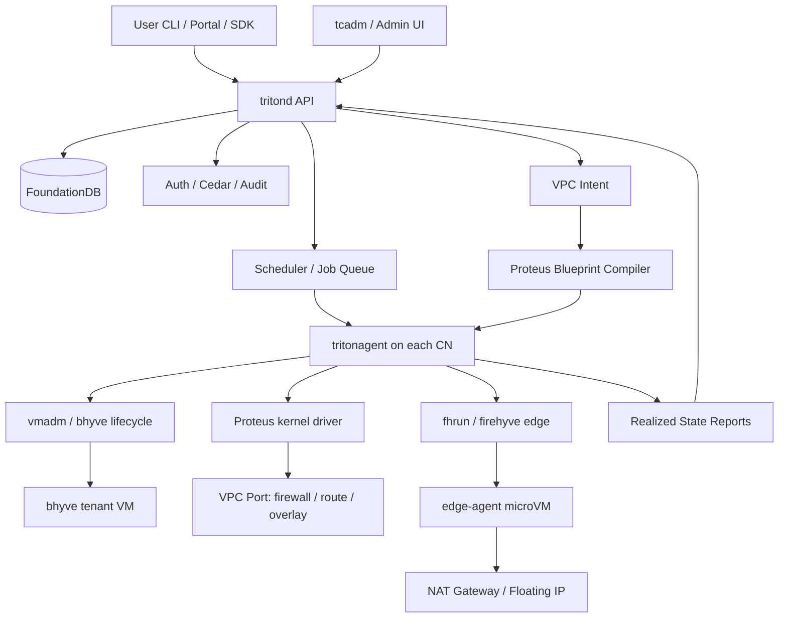
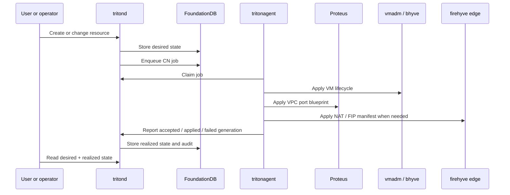
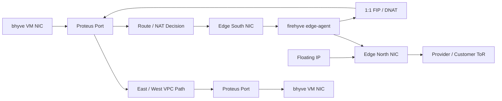

<!--
This Source Code Form is subject to the terms of the Mozilla Public
License, v. 2.0. If a copy of the MPL was not distributed with this
file, You can obtain one at https://mozilla.org/MPL/2.0/.

Copyright 2026 Edgecast Cloud LLC.
-->

# Triton vNext Architecture

The architecture is built around one control-plane truth, one node-local
actuator, and one VPC dataplane. Users and operators write intent to `tritond`.
`tritonagent` realizes that intent on SmartOS compute nodes. Proteus enforces
network policy at the VM port and edge.

## Control loop

The key product contract is desired state to realized state:

- `tritond` stores what should exist.
- `tritond` derives jobs and network blueprints from that intent.
- `tritonagent` applies those jobs locally.
- Proteus and firehyve edge microVMs carry packet behavior.
- The API, CLI, and UI show both the requested state and the applied state.

## Component boundaries

| Component | Owns | Does not own |
|---|---|---|
| `tritond` | API, auth, audit, scheduling, FDB metadata, resource invariants, desired state, job creation. | Direct packet forwarding, direct `vmadm` execution, UI-only workflows. |
| `tritonagent` | CN registration, heartbeats, job claiming, VM actuation, Proteus apply, edge process supervision, realized-state reporting. | Global scheduling decisions, tenant authorization policy, durable metadata truth. |
| Proteus | Port-local packet policy, distributed firewall, routing, overlays, generic dumps, trace/debug, kernel/userland control path. | Product resources such as tenants, projects, images, or operator workflows. |
| firehyve / `fhrun` | Running small Linux payloads as supervised microVMs for edge services. | The v1 end-user VM lifecycle, which remains bhyve-first. |
| Mariana UI | Admin and user workflows over the vnext API. | Private control paths around `tritond`. |

## V1 packet path

V1 should make this path boring and inspectable:

- same-VPC VM-to-VM traffic works;
- firewall policy can allow or deny it;
- private subnet traffic can egress through NAT;
- a floating IP can provide ingress to a VM;
- operators can see which generation was requested, accepted, applied, or
  failed.

## Why this shape

Triton vNext keeps the number of load-bearing services small. The control plane
is stateless around FoundationDB. Compute nodes are replaceable because their
local truth is derived from `tritond`. The dataplane is Triton-owned so VPC,
security, and edge behavior can evolve with the product instead of being a
permanent fork of another system.
