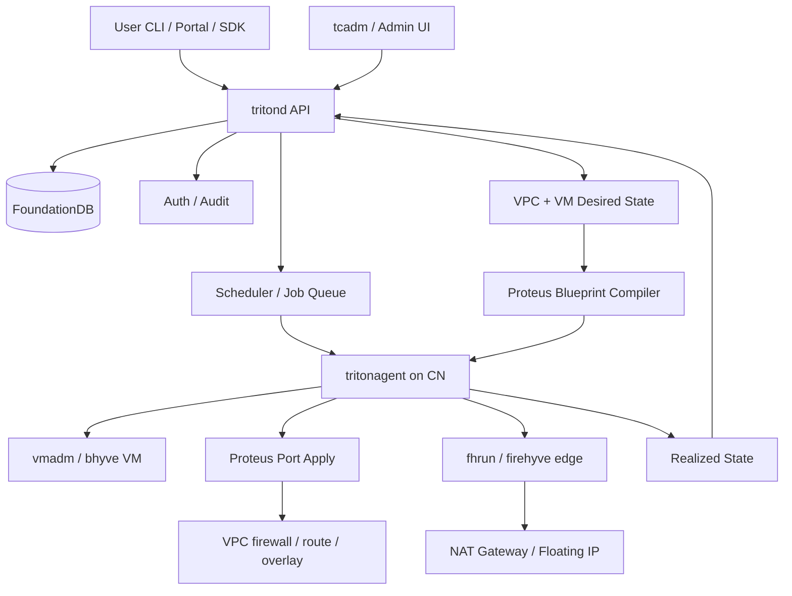
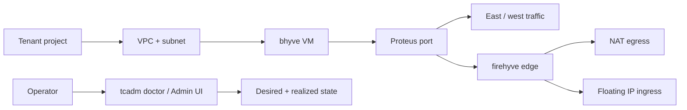

<!--
This Source Code Form is subject to the terms of the Mozilla Public
License, v. 2.0. If a copy of the MPL was not distributed with this
file, You can obtain one at https://mozilla.org/MPL/2.0/.

Copyright 2026 Edgecast Cloud LLC.
-->

# Triton vNext: Product and Architecture Summary

Triton vNext is the direction for Triton Cloud: a packaged private-cloud product
with a Rust control plane, SmartOS compute nodes, FoundationDB metadata,
Triton-owned VPC networking, and clear operator and user workflows.

This is more than a proof of concept. The current work already demonstrates the
core direction: `tritond`, `tritonagent`, `tcadm`, FoundationDB-backed metadata,
tenant/project resources, auth, audit, instance records, node registration, job
handling, and the Proteus VPC dataplane.

## What vNext is

| Part | Role |
|---|---|
| `tritond` | Desired-state control plane: API, auth, audit, scheduling, metadata, jobs. |
| FoundationDB | Durable metadata store; control-plane services stay stateless around it. |
| `tritonagent` | Per-node actuator: VM lifecycle, Proteus apply, edge supervision, health. |
| Proteus | Triton VPC dataplane: distributed firewall, routing, overlay, NAT/FIP policy. |
| firehyve / `fhrun` | Edge microVM runtime for v1 NAT and floating-IP services. |
| `tcadm` | Operator CLI for bootstrap, node approval, diagnosis, audit, and admin tasks. |
| UI / SDK / user CLI | User and operator workflows over the same `tritond` API. |

## Architecture

The important product contract is desired state to realized state:

1. User or operator writes intent to `tritond`.
2. `tritond` stores durable truth in FoundationDB.
3. `tritond` creates jobs and network blueprints.
4. `tritonagent` applies the work on the compute node.
5. Proteus and firehyve edge microVMs carry packet behavior.
6. `tritonagent` reports accepted, applied, or failed state.
7. CLI and UI show both the requested state and what actually happened.

## What v1 should look like

V1 should prove a complete operator-ready path:

- install and bootstrap `tritond` with FoundationDB;
- approve a SmartOS compute node;
- run `tritonagent` and receive heartbeats;
- create tenant, project, VPC, subnet, image, SSH key, and bhyve VM;
- attach a Proteus-backed NIC;
- provide guest private networking;
- support NAT egress and floating-IP ingress;
- repeat start, stop, reboot, delete, and cleanup;
- explain failures through `tcadm` and the admin UI.

## Where product input matters most

- Minimum v1 acceptance demo.
- Operator workflows that must be excellent on day one.
- Tenant workflows required before external evaluation.
- Whether firehyve is v1 edge-only or also a tenant-visible runtime.
- Image and guest-configuration contract.
- Package/flavor model.
- DNS and service-discovery commitments needed for Kelp later.
- Admin UI pages required for provisioning and network diagnosis.

## Not v1 blockers

Multi-region, Manta-backed storage, managed Kubernetes, tenant bare metal,
advanced load balancing, granular tenant roles, billing integration, GPU
placement, and live migration are future work unless a v1 data model would
otherwise paint the product into a corner.
