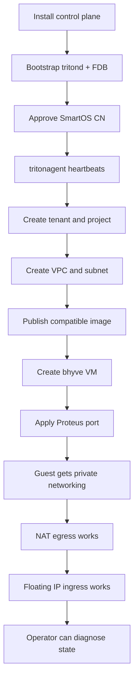

<!--
This Source Code Form is subject to the terms of the Mozilla Public
License, v. 2.0. If a copy of the MPL was not distributed with this
file, You can obtain one at https://mozilla.org/MPL/2.0/.

Copyright 2026 Edgecast Cloud LLC.
-->

# Triton vNext v1 Path

V1 should be the first release that a real operator can install, inspect, and
use to run tenant VMs in VPCs. The bar is not feature breadth; the bar is a
complete path with clear diagnostics.

## Product bar

V1 is product-ready when:

- an operator can install `tritond`, FoundationDB, `tritonagent`, Proteus, and
  the required CLI/UI artifacts on SmartOS;
- a compute node can register, be approved, heartbeat, claim work, provision a
  bhyve VM, apply network state, and report realized state;
- a tenant can create a project, VPC, subnet, SSH key, image-backed instance,
  NIC, disk, NAT gateway, and floating IP;
- the guest has private network configuration, egress through NAT, and optional
  ingress through a floating IP;
- start, stop, reboot, delete, and cleanup paths are repeatable;
- `tcadm` and the admin UI can explain where a failed request stopped.

## Acceptance path

## Workstreams

| Workstream | Demonstrated | Proposed v1 close-out |
|---|---|---|
| Control plane | `tritond` API, FDB-backed store, auth, audit, tenants, projects, instances, NICs, disks, floating IP records, agent jobs. | Scheduler, explicit job visibility, quota admission, parent-delete guards, VPC blueprint compilation, realized-state API. |
| Compute agent | Registration, approval, heartbeats, job claiming, `vmadm` paths for core lifecycle work. | Full provisioning plan apply, image import hardening, Proteus port attachment, failure recovery, support bundle hooks. |
| VPC dataplane | Proteus engine, wire types, kernel-driver path, Triton VPC plugin, firewall/router/NAT/FIP/overlay policy work. | Packaged driver, tritond-to-blueprint converter, agent apply path, generation reporting, operator trace/debug workflow. |
| Edge NAT/FIP | `fhrun` and edge-agent shape with north/south NICs and declarative dataplane blocks. | Stable `NatGateway` and FIP realization through supervised firehyve edge microVMs, health, logs, and replacement path. |
| Images and guest config | Image records and checksum-aware agent import path. | Brand/runtime compatibility metadata, guest SSH/network config delivery, Talos-compatible machine-config decision. |
| Operator UX | `tcadm` exists and already drives important control-plane operations. | `tcadm doctor`, job inspection, support bundles, install docs, package health checks, admin UI over vnext API. |
| User UX | API and generated client shape exists. | User CLI/portal workflows for project, VPC, subnet, instance, image, key, NAT, and FIP operations. |

## Input needed

These are product decisions, not just implementation tasks:

1. What is the minimum v1 acceptance demo that should be shown to customers or
   internal stakeholders?
2. Is firehyve v1 only an edge runtime, or must `brand=fhyve` be tenant-visible
   in v1?
3. What is the v1 image contract: curated public images, operator-published
   images, tenant import, or a narrower first path?
4. How should guest configuration be delivered for bhyve VMs and Talos images:
   metadata service, generated config disk, kernel command line, or staged
   support?
5. Which package/flavor model is required before users can launch real
   workloads?
6. Which DNS or service-discovery decisions must be made now so Kelp and future
   load balancers do not force migrations later?
7. Which admin UI pages are required for operators to trust provisioning and
   network state?

## Future, not v1 blockers

These remain important, but should not block the first product-ready path unless
their absence would force a v1 data-model rewrite:

- multi-region federation;
- Manta-backed block/object/file storage;
- Kubernetes as a managed service;
- tenant bare metal;
- advanced load balancing;
- customer BYO IP pools;
- flow logs and full traceflow;
- granular tenant roles;
- billing and rate-card integration;
- GPU placement and live migration.
